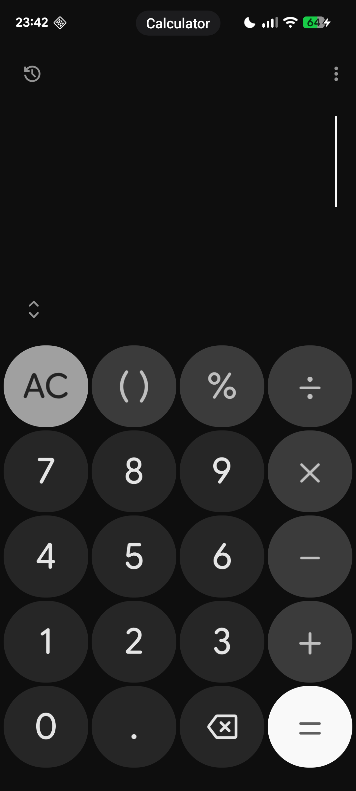

# 💊 PillShot — LSPosed Screenshot Labeler

> ⚠️ **Proof of Concept** — experimental LSPosed module that injects app name overlays into Android screenshots.
> For research and demonstration purposes only.

---

## Overview

**PillShot** hooks into Android’s internal **SystemUI method** to modify captured screenshots in real time. When a screenshot is taken, the module intercepts the bitmap, identifies the app that triggered the capture, and draws a small, centered, rounded “pill” at the top of the image showing the app’s name.

> **Important:** The pill overlay is **not drawn on the live screen** — it is only applied to the screenshot bitmap. End users will not see the pill while using the device; it appears only in the saved screenshot image.

---

## Demo


---

## Features

* 🖼️ Dynamically overlays the app name on screenshots
* 💊 Clean pill-shaped design with automatic text sizing
* 📱 Works in both portrait and landscape orientations
* 🧠 Reflection-based; minimal external dependencies

---

## Known Limitations

This is **not a production-ready module** — it is a Proof of Concept.

* ❌ **Unreliable status bar height detection** — the overlay may overlap with the status bar or system gestures area.
* ❌ **Status bar visibility not handled** — the pill does not adapt when the status bar is expanded, hidden, or in transient states.

---

## Installation (testing only)

1. Install LSPosed.
2. Clone repository:

```bash
git clone https://github.com/extreames/pillshot.git
cd pillshot
```

3. Build and install the module APK:

```bash
./gradlew assembleDebug
adb install -r app/build/outputs/apk/debug/app-debug.apk
```

4. Enable the module in LSPosed and reboot.
5. Take a screenshot and inspect the saved image — the pill should be visible within the screenshot file.

---

## License

**MIT** — free to use, modify, and build upon.
